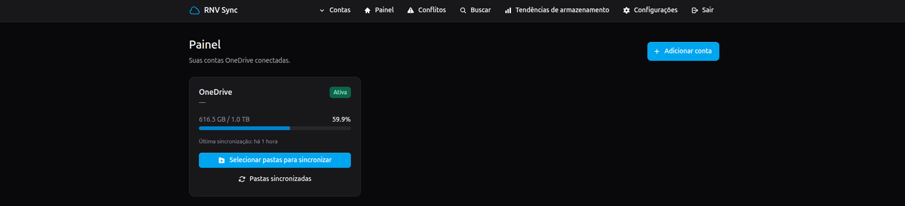
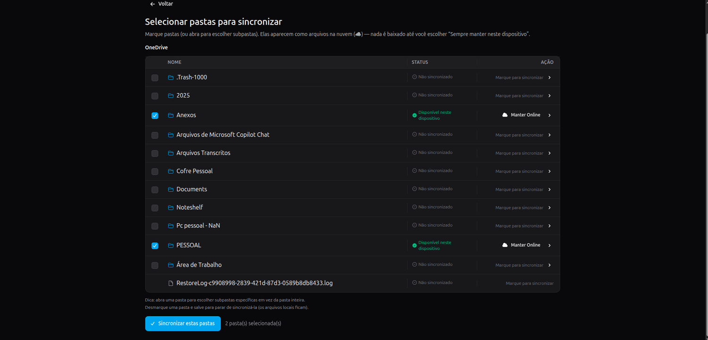
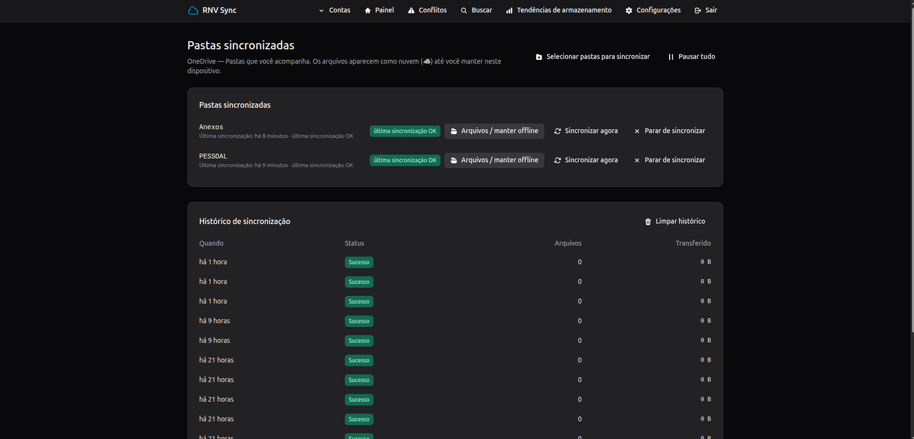
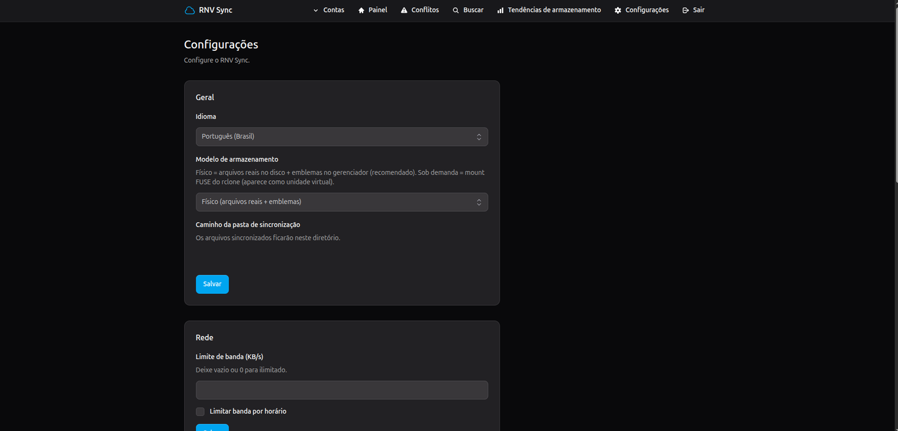
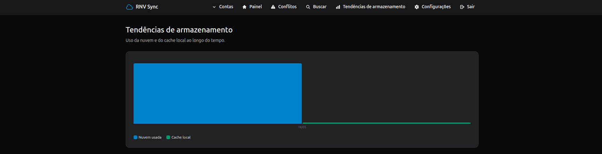
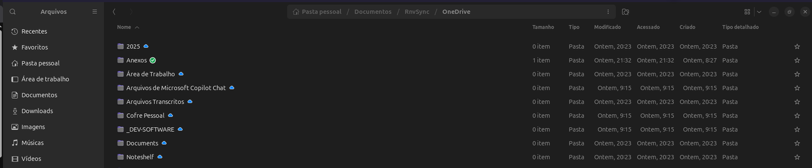
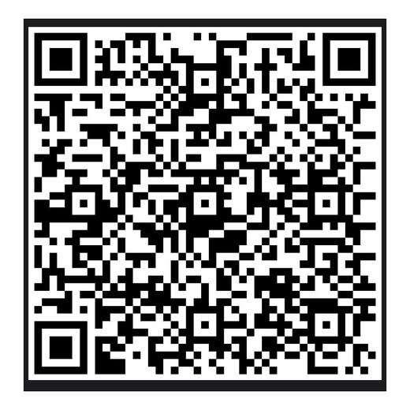

# RNV Sync

[Português](README.md) · **English**

> A beautiful, self-hosted OneDrive client for Linux — powered by
> [rclone](https://rclone.org/).

RNV Sync gives Linux users a clean, native-feeling web interface to
manage OneDrive accounts: selective folder sync, files-on-demand
(☁ cloud / ✓ on device), real-time upload, a system-tray icon and
file-manager integration (emblems).

It is a Laravel app that bundles and orchestrates rclone — the same
relationship GitHub Desktop has with git: rclone is the trusted,
battle-tested engine; RNV Sync is the polished UX and lifecycle layer.



## Why

- **No CLI** — connect accounts and manage everything from a browser.
- **Your data stays local** — encrypted tokens, **zero telemetry**,
  panel binds to `127.0.0.1` only.
- **Powered by rclone** — bundled **unmodified**.
- **Real-time** — edit a file, it reaches the cloud in seconds.
- **Lightweight** — idle and gentle on the machine.

## How it works

1. Connect your OneDrive account (Microsoft login inside the app).
2. **All folders show up online automatically** — the moment the
   account is linked, everything is mirrored as cloud ☁ in the file
   manager and the web app, downloading nothing and with no folder
   picking step.
3. Per item: **Keep local** (real download, ✓) or **Online only**
   (upload & free space, back to ☁).
4. Local edits upload on their own; cloud edits come down for the
   items you keep offline.

## Install

Requires **PHP 8.3+**, **Composer**, **git**, Linux with systemd.
The installer handles the rest and asks for a password in a
**graphical dialog** when needed (no root terminal).

```bash
# Install from a self-cleaning temp dir — nothing visible is left in Home.
tmp="$(mktemp -d)"
git clone --depth 1 https://github.com/renanvolpato/rnv-sync.git "$tmp/rnv-sync"
bash "$tmp/rnv-sync/install/bootstrap.sh"   # system dependencies
bash "$tmp/rnv-sync/install/install.sh"     # installs (hidden) to ~/.local/share/rnv-sync + services
rm -rf "$tmp"                                # remove the downloaded copy
```

> The app lives **hidden** in `~/.local/share/rnv-sync` (Linux convention,
> not shown in the file manager). The only visible folder is your
> **synced files** (`~/RnvSync`). If you install with a plain `git clone`,
> remember to delete that clone afterwards — it's just the download; the
> real app is the one under `~/.local`.

Open <http://localhost:8770> and finish the setup wizard. Details:
[docs/installation.md](docs/installation.md).

## Update

```bash
bash ~/.local/share/rnv-sync/install/update.sh
```

One command: pull, deps, migrate, rebuild, restart services. **Your
synced files are never touched.**

## Uninstall

```bash
bash ~/.local/share/rnv-sync/install/uninstall.sh
```

Removes services, integrations and the app (asks to confirm). Files
you already synced stay on disk.

## Screenshots

| Select folders | Synced folders |
|---|---|
|  |  |

| Settings | Storage trends |
|---|---|
|  |  |



## Features

- First-run wizard; panel password with brute-force throttling
- OneDrive **Personal, Business and SharePoint** via in-app Microsoft
  OAuth (encrypted tokens, automatic refresh)
- Selective folder sync; files-on-demand (keep local / online only)
- **Real-time upload** (file watcher) + scheduled safety sync
- **System-tray** icon (animated while syncing) and file-manager
  **emblems**
- Conflict detection & visual resolution
- Bandwidth limit + scheduler; cross-account search; usage trends
- Config export/import; PT-BR & EN; dark mode
- Runs in the background via systemd (survives logout/reboot),
  lightweight and idle

## Documentation

[Installation](docs/installation.md) ·
[Configuration](docs/configuration.md) ·
[Usage](docs/usage.md) ·
[Microsoft OAuth](docs/oauth.md) ·
[Troubleshooting](docs/troubleshooting.md) ·
[FAQ](docs/faq.md) ·
[Security](docs/security.md) ·
[Architecture](docs/architecture.md)

## Development

```bash
bash install/bootstrap.sh      # or: composer setup
php artisan serve --port=8770
php artisan test
```

Requires PHP 8.3 with `pdo_sqlite`. See [CONTRIBUTING.md](CONTRIBUTING.md).

## Support 💛

RNV Sync is free and open source. If it helps you, a PIX donation of
any amount keeps the project alive. 🙏



Scan it with your bank app, or use the copy-paste code and details in
**[DOACAO.md](DOACAO.md)**.

## License

MIT — see [LICENSE](LICENSE). RNV Sync bundles the official rclone
binary **unmodified**; rclone's license is in
[LICENSES/rclone.txt](LICENSES/rclone.txt).

## Credits

[rclone](https://rclone.org/) · [Laravel](https://laravel.com) ·
[Livewire](https://livewire.laravel.com) ·
[Flux UI](https://fluxui.dev) · [Tailwind CSS](https://tailwindcss.com)
